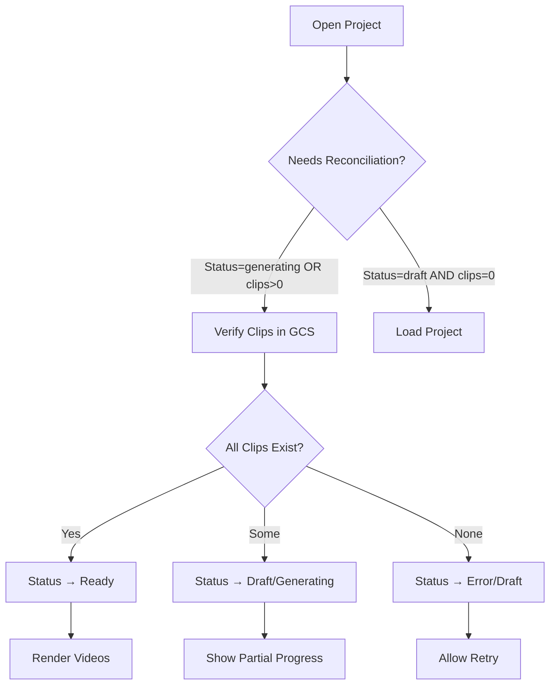

# Reel Maker - Quick Reference Guide

## 🚨 Common Issues & Solutions

### Issue 1: Project Stuck in "Generating"
**Symptoms:**
- Status shows "generating" forever
- Videos exist in GCS but don't render
- Can't start new generation

**Solution:**
✅ **Automatic** - Just reload the project page
- System auto-detects and corrects state
- Videos appear immediately if they exist

**Manual:**
```bash
# If automatic doesn't work, run cleanup script
python scripts/cleanup_stale_reel_jobs.py
```

### Issue 2: Videos Not Appearing
**Symptoms:**
- Status says "ready" but no videos show
- Generation completed but clips missing

**Solution:**
1. Open browser console (F12)
2. Look for reconciliation logs:
   ```
   Auto-reconciling project... (status: ready)
   Project state corrected: {...}
   ```
3. Refresh the page - should auto-fix

### Issue 3: Generation Keeps Starting Over
**Symptoms:**
- Click "Generate" - all videos regenerate
- Already have 15 videos but making 15 more
- Wasting API quota

**Solution:**
✅ **Fixed in latest version**
- System now preserves existing clips
- Only generates missing ones
- Check logs: "Skipping prompt X - clip already exists"

## 🔧 Manual Recovery Tools

### Check Stale Jobs
```bash
# Default: 30 minute timeout
python scripts/cleanup_stale_reel_jobs.py

# Custom timeout: 60 minutes
python scripts/cleanup_stale_reel_jobs.py --timeout 60
```

### Verify GCS Storage
```bash
# List videos for a project
gcloud storage ls "gs://phoenix-videos/reel-maker/{userId}/{projectId}/**/*.mp4"

# Count videos
gcloud storage ls "gs://phoenix-videos/reel-maker/{userId}/{projectId}/**/*.mp4" | wc -l
```

### Check Project Status
```bash
# Use Firebase console or check logs
# Look for: "Updated project {id} fields: ['status', ...]"
```

## 📊 Understanding Status States

| Status | Meaning | What to Do |
|--------|---------|------------|
| `draft` | No videos generated yet | Click "Generate clips" |
| `generating` | Videos being created | Wait or refresh to check progress |
| `ready` | All videos complete | Videos should render automatically |
| `error` | Generation failed | Refresh page, then retry generation |

## 🎯 How Reconciliation Works



## 🔍 Debugging Checklist

### Backend (Check Logs)
```bash
# Production logs
gcloud logging read "resource.type=cloud_run_revision AND resource.labels.service_name=phoenix" --limit 50 --format json

# Look for:
# - "Auto-reconciling project..."
# - "Project state corrected..."
# - "Detected stale job..."
```

### Frontend (Browser Console)
```javascript
// Should see on project load:
"Auto-reconciling project pwY... (status: generating)"
"Project state corrected: {status: 'generating → ready', clips: '0 → 15'}"
```

### Database (Firestore Console)
```
Collection: reel_maker_projects
Document: {projectId}
Fields to check:
- status: draft | generating | ready | error
- clipFilenames: array of GCS paths
- promptList: array of prompts
```

### Storage (GCS Console)
```
Bucket: phoenix-videos
Path: reel-maker/{userId}/{projectId}/raw/reeljob-{id}/prompt-XX/{hash}/sample_0.mp4
Verify: Files exist at paths claimed in clipFilenames
```

## 🚀 Testing Your Changes

### Test Case 1: Fresh Project
```
1. Create new project
2. Add 3 prompts
3. Click "Generate clips"
4. Wait for completion
5. Verify: 3 videos render
```

### Test Case 2: Stuck Project
```
1. Open "horizontal test 1" or "vertical test 1"
2. Check console for reconciliation
3. Verify: Status changes to "ready"
4. Verify: Videos render immediately
```

### Test Case 3: Interrupted Generation
```
1. Start generation
2. Kill server mid-process
3. Restart server
4. Open project
5. Verify: Partial clips preserved
6. Click "Generate" - only missing ones created
```

### Test Case 4: Timeout Recovery
```
1. Wait for 30+ minutes with stuck job
2. Run: python scripts/cleanup_stale_reel_jobs.py
3. Verify: Job marked as failed
4. Open project
5. Verify: Status is "error"
6. Click "Generate" - starts fresh
```

## 📞 When to Escalate

Contact support if:
- ❌ Reconciliation runs but doesn't fix state
- ❌ Videos exist in GCS but still won't render
- ❌ Same project gets stuck repeatedly
- ❌ Cleanup script reports errors
- ❌ Status keeps flipping between states

## 💡 Pro Tips

1. **Always check console first** - reconciliation logs tell you what happened
2. **Refresh before clicking Generate** - ensures you have latest state
3. **Run cleanup script daily** - prevents accumulation of zombie jobs
4. **Monitor GCS usage** - stale videos consume storage quota
5. **Log reconciliation reports** - helps identify patterns

## 🎓 Understanding the Flow

### Normal Generation
```
1. User clicks "Generate clips"
2. Backend creates job
3. For each prompt:
   - Call Veo API
   - Upload to GCS
   - Update clipFilenames
4. Status: generating → ready
5. Frontend renders videos
```

### Reconciliation Flow
```
1. User opens project
2. Frontend checks if reconciliation needed
3. Backend verifies each clip in GCS
4. Mismatches corrected:
   - Remove non-existent paths
   - Update status based on reality
5. Frontend refetches and renders
```

### Timeout Flow
```
1. Job runs >30 minutes
2. Cleanup script detects staleness
3. Job marked as failed
4. Project status → error
5. User can retry generation
```

## 📦 Version History

### v2 (Current) - State Reconciliation
- ✅ Auto-healing projects
- ✅ Timeout detection
- ✅ Smart clip preservation
- ✅ No wasteful regeneration

### v1 (Old) - Basic Generation
- ❌ Could get stuck
- ❌ Always regenerated all clips
- ❌ No recovery mechanism

## 🔐 Security Notes

- All endpoints require authentication
- Users can only access own projects
- CSRF protection on mutations
- GCS access controlled by IAM
- No direct DB manipulation

## ⚡ Performance Tips

- Reconciliation adds ~100-500ms to project load
- Only runs when needed (status=generating OR clips>0)
- GCS verification is parallel where possible
- Cleanup script is lightweight (safe to run often)

---

**Need Help?**
1. Check console logs first
2. Run cleanup script
3. Verify GCS contents
4. Check Firestore data
5. Review this guide
