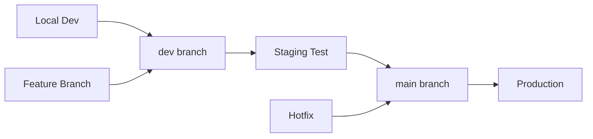

# 🚀 Phoenix Development Workflow & Staging Environment Guide

## Table of Contents
1. [Environment Overview](#environment-overview)
2. [Development Workflow](#development-workflow)
3. [Staging Environment Configuration](#staging-environment-configuration)
4. [Deployment Pipeline](#deployment-pipeline)
5. [Monitoring & Debugging](#monitoring--debugging)
6. [Common Operations](#common-operations)
7. [Troubleshooting](#troubleshooting)

## Environment Overview

### 🏗️ Infrastructure Architecture

```
┌─────────────────┐    ┌─────────────────┐
│   Development   │    │   Production    │
│                 │    │                 │
│ Local Testing   │    │ phoenix service │
│ localhost:5000  │    │ (main branch)   │
└─────────────────┘    └─────────────────┘
         │                       │
         ▼                       ▼
┌─────────────────┐    ┌─────────────────┐
│     Staging     │    │  Shared Resources│
│                 │    │                 │
│ phoenix-dev     │◄───┤ • Firestore DB  │
│ (dev branch)    │    │ • GCP Secrets   │
└─────────────────┘    │ • Firebase Auth │
                       └─────────────────┘
```

### 🌐 Environment URLs
- **Local Development**: `http://localhost:5000`
- **Staging**: `https://phoenix-dev-234619602247.us-central1.run.app`
- **Production**: `https://phoenix-234619602247.us-central1.run.app`

### 📊 Resource Allocation
| Environment | Service Name | CPU | Memory | Max Instances | Auto-Deploy Branch |
|-------------|--------------|-----|---------|---------------|-------------------|
| Staging     | phoenix-dev  | 1   | 1Gi     | 5             | dev              |
| Production  | phoenix      | 2   | 2Gi     | 100           | main             |

## Development Workflow

### 🔄 Recommended Git Flow



### 📝 Step-by-Step Workflow

#### 1. **Local Development**
```bash
# Start local development server
./start_local.sh

# Make your changes
# Test locally at http://localhost:5000
```

#### 2. **Staging Deployment**
```bash
# Ensure you're on dev branch
git checkout dev
git pull origin dev

# Make changes and commit
git add .
git commit -m "feat: implement new feature"

# Push to trigger staging deployment
git push origin dev
```

#### 3. **Staging Testing**
```bash
# Check deployment status
./scripts/manage_env.sh status

# Open staging environment
./scripts/manage_env.sh open staging

# Monitor staging logs
./scripts/manage_env.sh logs staging --hours 2

# Test all functionality thoroughly
```

#### 4. **Production Release**
```bash
# Only when staging testing is complete
git checkout main
git pull origin main

# Merge dev into main
git merge dev

# Push to trigger production deployment
git push origin main

# Monitor production deployment
./scripts/manage_env.sh logs production --hours 1
```

## Staging Environment Configuration

### ⚙️ Cloud Build Configuration

#### Staging Build (`cloudbuild-dev.yaml`)
```yaml
steps:
  - name: 'gcr.io/cloud-builders/docker'
    args: ['build', '-t', 'gcr.io/$PROJECT_ID/phoenix-dev', '.']
  
  - name: 'gcr.io/cloud-builders/docker'
    args: ['push', 'gcr.io/$PROJECT_ID/phoenix-dev']
  
  - name: 'gcr.io/google.com/cloudsdktool/cloud-sdk'
    entrypoint: gcloud
    args:
    - 'run'
    - 'deploy'
    - 'phoenix-dev'
    - '--image'
    - 'gcr.io/$PROJECT_ID/phoenix-dev'
    - '--region'
    - 'us-central1'
    - '--platform'
    - 'managed'
    - '--allow-unauthenticated'
    - '--cpu'
    - '1'
    - '--memory'
    - '1Gi'
    - '--max-instances'
    - '5'
  - '--update-secrets'
  - 'GEMINI_API_KEY=phoenix-gemini-api-key:latest,SECRET_KEY=phoenix-secret-key:latest,GOOGLE_API_KEY=phoenix-google-api-key:latest,GOOGLE_SEARCH_ENGINE_ID=phoenix-search-engine-id:latest'

images:
  - 'gcr.io/$PROJECT_ID/phoenix-dev'

options:
  logging: CLOUD_LOGGING_ONLY
```

### 🔧 Cloud Build Triggers

| Trigger Name | Branch Pattern | Build Config | Target Service |
|--------------|----------------|--------------|----------------|
| phoenix-dev-deploy | ^dev$ | cloudbuild-dev.yaml | phoenix-dev |
| phoenix-deploy | ^main$ | cloudbuild.yaml | phoenix |

## Deployment Pipeline

### 🚀 Automatic Deployments

#### Staging Pipeline (dev branch)
```
Code Push → GitHub → Cloud Build Trigger → Container Build → Cloud Run Deploy
```

#### Production Pipeline (main branch)  
```
Code Push → GitHub → Cloud Build Trigger → Container Build → Cloud Run Deploy
```

### ⏱️ Deployment Timeline
- **Build Time**: ~2-3 minutes
- **Deploy Time**: ~30 seconds
- **Total Pipeline**: ~3-4 minutes

### 📋 Deployment Checklist

#### Before Staging Deploy
- [ ] Local tests pass
- [ ] Code review completed
- [ ] Feature branch merged to dev

#### Before Production Deploy
- [ ] Staging testing completed
- [ ] All critical user flows tested
- [ ] Performance acceptable
- [ ] No errors in staging logs
- [ ] Team approval received

## Monitoring & Debugging

### 📊 Log Monitoring

#### Enhanced Log Fetching Script
```bash
# Environment-specific log fetching
python scripts/fetch_logs.py --environment staging --hours 6
python scripts/fetch_logs.py --environment production --hours 2

# Search for specific issues
python scripts/fetch_logs.py --environment staging --search "error"
python scripts/fetch_logs.py --environment staging --search "my-links"

# Save logs in JSON format for analysis
python scripts/fetch_logs.py --environment staging --save-json
```

#### Log Analysis Features
- **Error Pattern Recognition**: Automatically categorizes common errors
- **Severity Breakdown**: Shows ERROR, WARNING, INFO counts
- **Recent Error Summary**: Displays last 10 errors with context
- **Recommendations**: Provides specific fix suggestions

### 🛠️ Environment Management Script

```bash
# Check status of both environments
./scripts/manage_env.sh status

# Deploy commands
./scripts/manage_env.sh deploy staging
./scripts/manage_env.sh deploy production

# Log fetching
./scripts/manage_env.sh logs staging --hours 6
./scripts/manage_env.sh logs production --search "error"

# Open in browser
./scripts/manage_env.sh open staging
./scripts/manage_env.sh open production
```

## Common Operations

### 🔄 Daily Development

#### Starting Work
```bash
# Switch to dev branch
git checkout dev
git pull origin dev

# Start local server
./start_local.sh

# Check current environment status
./scripts/manage_env.sh status
```

#### Testing Changes
```bash
# Test locally first
# http://localhost:5000

# Deploy to staging
git add .
git commit -m "feat: your change description"
git push origin dev

# Wait for deployment (check build status)
./scripts/manage_env.sh status

# Test in staging
./scripts/manage_env.sh open staging

# Check for errors
./scripts/manage_env.sh logs staging --hours 1
```

#### Releasing to Production
```bash
# Merge to main
git checkout main
git pull origin main
git merge dev
git push origin main

# Monitor deployment
./scripts/manage_env.sh logs production --hours 1
```

### 🚨 Emergency Hotfixes

#### Critical Production Issue
```bash
# Create hotfix branch from main
git checkout main
git checkout -b hotfix/critical-issue

# Make minimal fix
# ... edit files ...

# Test locally
./start_local.sh

# Commit and push to main
git add .
git commit -m "hotfix: critical issue description"
git checkout main
git merge hotfix/critical-issue
git push origin main

# Monitor deployment
./scripts/manage_env.sh logs production --hours 1

# Merge back to dev
git checkout dev
git merge main
git push origin dev
```

### 📈 Feature Development

#### Large Feature Development
```bash
# Create feature branch
git checkout dev
git checkout -b feature/new-feature

# Develop feature
# ... multiple commits ...

# Test locally thoroughly
./start_local.sh

# Merge to dev for staging testing
git checkout dev
git merge feature/new-feature
git push origin dev

# Test in staging
./scripts/manage_env.sh open staging
./scripts/manage_env.sh logs staging --hours 2

# When ready, merge to main
git checkout main
git merge dev
git push origin main
```

## Troubleshooting

### 🔍 Common Issues

#### 1. Staging Service Out of Memory
**Symptoms**: SIGKILL errors, worker timeouts
**Solution**: 
```bash
# Check current resource allocation
gcloud run services describe phoenix-dev --region=us-central1

# Update memory if needed (already set to 1Gi)
# Edit cloudbuild-dev.yaml memory setting
```

#### 2. Build Failures
**Symptoms**: Build status shows FAILURE
**Solution**:
```bash
# Check build logs
gcloud builds list --limit=5
gcloud builds log [BUILD_ID]

# Common fixes:
# - Check Dockerfile syntax
# - Verify requirements.txt
# - Check for import errors
```

#### 3. Environment Not Responding
**Symptoms**: 502/503 errors, timeouts
**Solution**:
```bash
# Check service status
./scripts/manage_env.sh status

# Check recent logs for errors
./scripts/manage_env.sh logs staging --hours 1

# Check if deployment is in progress
gcloud builds list --limit=1
```

#### 4. Database Connection Issues
**Symptoms**: Firestore connection errors
**Solution**:
```bash
# Check if secrets are properly mounted
gcloud run services describe phoenix-dev --region=us-central1

# Verify firebase credentials in logs
./scripts/manage_env.sh logs staging --search "firebase"
```

### 📞 Getting Help

#### Debug Information to Collect
```bash
# Environment status
./scripts/manage_env.sh status

# Recent builds
gcloud builds list --limit=5

# Service configuration
gcloud run services describe phoenix-dev --region=us-central1

# Recent logs with errors
./scripts/manage_env.sh logs staging --hours 2
./scripts/manage_env.sh logs production --hours 2
```

#### Useful Commands for Debugging
```bash
# Check current branch and status
git status
git branch

# Check last few commits
git log --oneline -10

# Check if there are uncommitted changes
git diff
git diff --staged

# Check remote tracking
git remote -v
```

## Best Practices

### ✅ Do's
- Always test in staging before production
- Use descriptive commit messages
- Monitor logs after deployments
- Keep staging and production configurations in sync
- Use feature branches for large changes
- Run local tests before pushing

### ❌ Don'ts
- Don't push directly to main for regular features
- Don't skip staging testing
- Don't ignore staging errors
- Don't deploy large changes during peak hours
- Don't commit sensitive information
- Don't force push to main or dev branches

### 🎯 Quality Gates
- **Local**: All manual tests pass
- **Staging**: No errors in logs, all user flows work
- **Production**: Monitor for 30 minutes after deployment

---

*This workflow ensures safe, reliable deployments while maintaining development velocity. Always prioritize testing and monitoring to catch issues early.*
